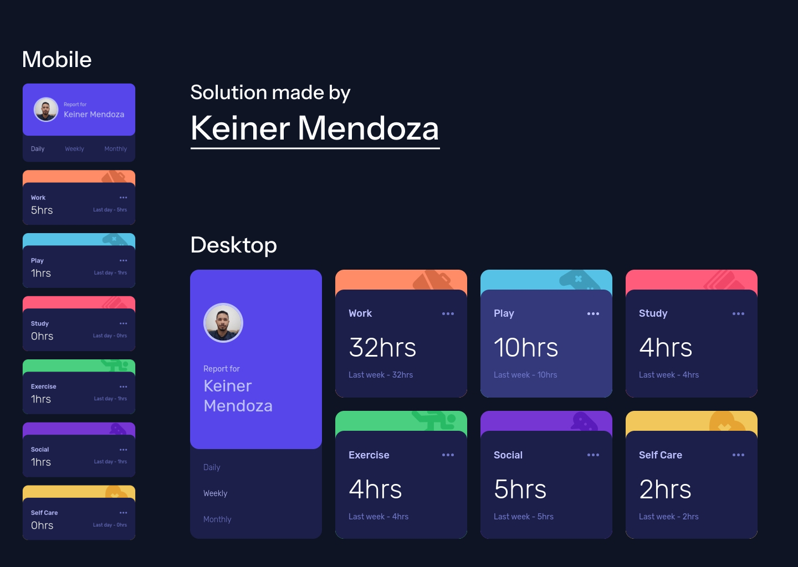

# Frontend Mentor - Time tracking dashboard solution

This is a solution to the [Time tracking dashboard challenge on Frontend Mentor](https://www.frontendmentor.io/challenges/time-tracking-dashboard-UIQ7167Jw). Frontend Mentor challenges help you improve your coding skills by building realistic projects. 

### Screenshot

### Links

- Solution URL: [Available on Frontend Mentor](https://www.frontendmentor.io/solutions/time-tracking-dahsboard-made-with-react-tailwindcss-iFq2sbqgIC)
- Live Site URL: [Hosted on Vercel](https://fm-time-tracking-weld.vercel.app/)

## My process

### Built with
- Tailwindcss
- React
- Semantic HTML5 markup
- CSS custom properties
- Flexbox
- CSS Grid
